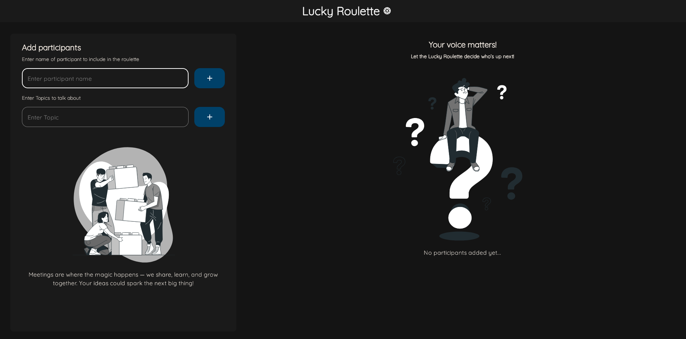
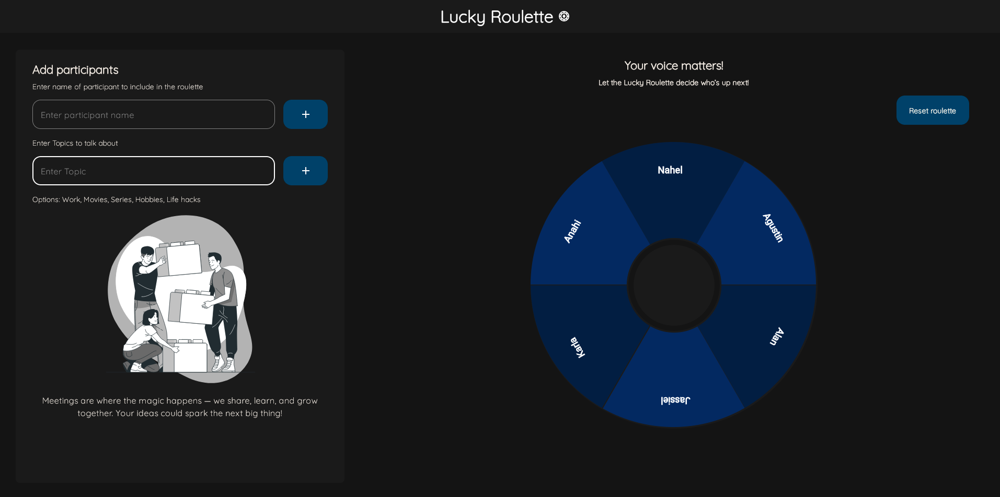
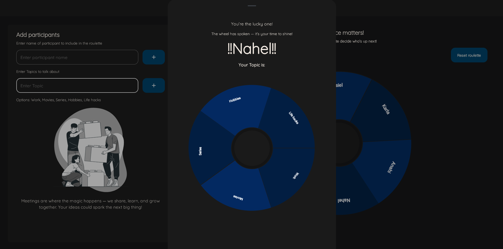

# Lucky Roulette

**Lucky Roulette** is a Kotlin Multiplatform application designed to make meetings more engaging and interactive. This tool allows you to add participants, define topics, and spin a roulette to randomly select both a participant and a topic. Perfect for encouraging participation and making meetings more dynamic!

## Features

- **Add Participants**: Easily add participants to the roulette.
- **Add Topics**: Define topics for discussion to be selected randomly.
- **Interactive Roulette**: Spin the roulette to randomly choose a participant and a topic.
- **User-Friendly Interface**: Built with Compose Multiplatform for a seamless and intuitive user experience.

## Technologies Used

- **Kotlin Multiplatform**: Shared code across multiple platforms.
- **Compose Multiplatform**: For building the user interface.
- **Kotlin/Wasm**: Web compatibility.

## Project Structure

- `/composeApp`: Contains shared and platform-specific code for the application.
  - `commonMain`: Code shared across all platforms.
  - `wasmMain`: Code specific to the web target.

## How to Run

1. Ensure your development environment is set up for Kotlin Multiplatform.
2. Run the following command to start the web application:

   ```bash
   ./gradlew :composeApp:wasmJsBrowserDevelopmentRun
   ```

3. Open the application in your browser and start adding participants and topics.

## Usage

1. **Add Participants**: Enter the name of a participant and click "Add".
2. **Add Topics**: Enter a topic and add it to the list.
3. **Spin the Roulette**: Click the roulette to randomly select a participant and a topic.
4. **Reset the Roulette**: Use the "Reset roulette" button to clear the participants and topics.

## Screenshots

<details>
<summary>Empty/Initial Screen</summary>


</details>

<details>
<summary>Participants Screen</summary>


</details>

<details>
<summary>Winner Screen</summary>


</details>

## Troubleshooting

When you `add`, `update` or `remove` dependencies, you may need to run the following command to ensure everything is up to date:

```bash
./gradlew kotlinNpmInstall
```

## Contributing

If you'd like to contribute to the project, feel free to open an issue or submit a pull request.

## License

This project is licensed under the MIT License. See the `LICENSE` file for details.

## Resources

- [Kotlin Multiplatform](https://www.jetbrains.com/help/kotlin-multiplatform-dev/get-started.html)
- [Compose Multiplatform](https://github.com/JetBrains/compose-multiplatform/#compose-multiplatform)
- [Kotlin/Wasm](https://kotl.in/wasm/)

Make your meetings more exciting with **Lucky Roulette**!